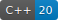
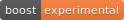
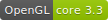
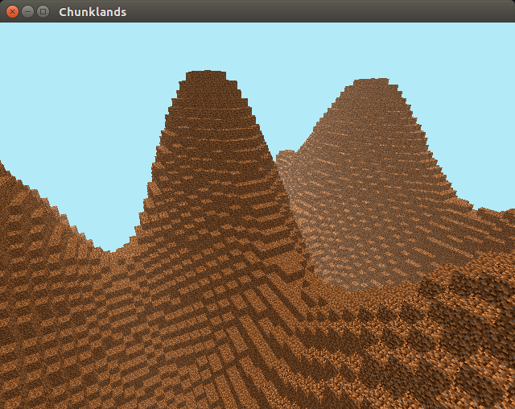

# Chunklands

> This page is designed for developers.

If you want to read more of the project, goals, etc. please have a look at [chunklands.de](https://chunklands.de).


## Technologies









## Installation

Requirements:

- node.js 14+
- clang-10+
- cmake 3.0+ (for glfw)

**Linux**

```bash
make setup
```

**MacOS**

```bash
make setup
```

MacOS ships apple clang. It's likely to be incompatible, so another vendor-free clang version is needed.

```bash
brew install llvm

# add this to your .env file
cat .env
# CLANG_BIN=/usr/local/opt/llvm/bin/clang
# CLANG_TIDY_BIN=/usr/local/opt/llvm/bin/clang-tidy
```

**Windows:**

*not supported, sorry*

## Development

watch files and build
```bash
npm run dev
```

start game
```bash
npm start
```

## Links

- [GitHub Issues](https://github.com/20hoibe/chunklands/issues)
- [GitHub Project](https://github.com/20hoibe/chunklands/projects/1)
- [Code Documentation](https://chunklands.de/wiki)


## Progress

Current status:


