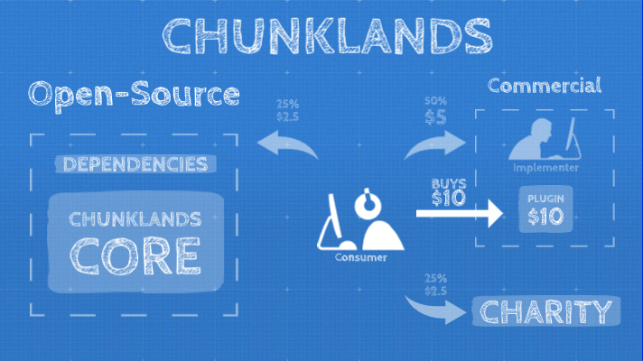

# 🎮 Chunklands 🎮

> **This is not a political statement, it's about human rights:**
>
> *"We will not accept racism in our community! If you support racism in any way, please stay away from this community, don't even sponsor us and rethink your attitude."*

Chunklands is a 3D-Game (another Minecraft clone) with a very different big picture.
Chunklands is open-source driven and will be developed with these 3 pillars in mind:

- support **Education** 🤓
- support **Open-Source** 💻
- support **Charity** 🧡

## Goals 🥅

You may have noticed close resemblance to Minecraft and indeed it's a clone at the moment, but the product should be very different and the product is not only the result itself.

### 💡 Main Goals (by the 3 pillars)

**1. Educational value 🤓**
> *"We want pupils and students to be able to learn programming with an open-source game"*

Mostly games is where young people spend a lot of time. Why not give them a tool, where they can change their game e.g. writing a new story for the game.

**2. Open-Source 💻**
> *"We want the core to be open-source all the time and"*

The core is the underlying engine and the basic module, which is everything you need to make a game or a new plugin.

**3. Charity 🧡**
> *"We want to spend a portion of the money made with a commercial intention for charity"*

Every purchaser can decide which charity organisation to support.

### 🔍 Common Goals

**1. Nothing is for free 💸**
> *"We want it to have different offers of commercial plugins where every purchase has 50% for the implementer and 25% will proportionally go back to open-source developers who are responsible to make all of this happen and 25% for charity"*

This is a basic idea. Of course we need to talk about implementation.

**2. Light-Weight Setup ⚙️**
> *"We want a game to have an open light-weight scripting interface for extension"*

When the environment to extend a game is much more complicated than the planned extension itself it may not happen. When the setup is easy and also small changes are possible with few effort, then we believe it's likely to happen.

**3. Open-Source together 🍻**
> *"We want the core to be developed together in the open and enable implemention of different games based on the same engine"*

Different people with different ages may want to play different versions of Chunklands. Building a village or an farm living in harmony with the nature and the animals. Building a base with advanced technologies harvesting resources. Play a role-play game with exercises. Play together online with friends.

# Closing words 🧭

> Chunklands should and will be whatever the community makes out of it.
>
> — with the power of open-source